---
geometry: margin=1in
---
# PROJECT Design Documentation

# Team Information
* Team name: Team A
* Team members
  * Adam Seidman
  * Ketaki Tilak
  * Nathan Page
  * Audrey Rovero

## Executive Summary

Team A proposes to design an web application that can be used to play checkers.
The project, named WebCheckers, will allow players to sign in and
be able to play checkers with other users online.

The need for this web application arose from the desire for a user to
play checkers in an easy to use web page environment.
  

### Purpose
The purpose of Web Checkers is to create a new web application for
users to play a game of checkers.
The main goals of the project are as followed:

 * Players must sign-in before playing a game of checkers
 * Two players that are signed-in are able to play with each other
 * All checker games must be played according to the American rules
 * Players will make their moves with drag-and-drop browser capabilities
 * A player currently in a game may choose to resign from the game, thus ending it

### Glossary and Acronyms

| Term | Definition |
|------|------------|
| VO | Value Object |
| UI |User Interface|

## Requirements

This section describes the features of the application.

### Definition of MVP

The Minimum Viable Product of this project is the creation of a American rule
based checkers games that requires two signed-in players.

### MVP Features
The required features of the MVP are as followed:

 * Every player is required to sign-in prior to playing a game, and
   must be able to sign-out when they are done playing
 * Two players must be able to play a game of checkers based
   upon the American rules
 * Either player of a game may choose to resign, at any time, thus ending the game

### Roadmap of Enhancements
The enhancements that we are planning to implement are:

  * Players may play a game against an artificial intelligence player
  * Players that are not currently in a game can view an on-going game

## Application Domain

This section describes the application domain.

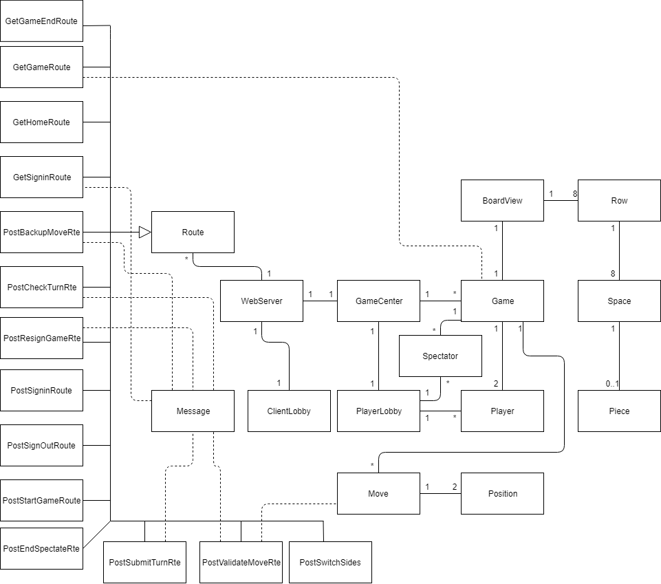

The application domain, pictured above, contains multiple important entities.
One of these entities, the Player, plays an important role in the overall application.

A checkers player is represented as a Player in the WebCheckers Application and two players are needed to play a game
of WebCheckers. Each Player plays the game with 12 Pieces, and the pieces must be placed on valid spaces on the game board.
The game board is represented as the BoardView, and contains 8 rows, which each contain 8 spaces.
The BoardView contains 64 spaces in total, which are where pieces are placed on by moves. Multiple moves can be made during 
a game of checkers and these moves are made when it is a player's turn. A move is made based upon two positions, a starting position
and an ending position. If both of these positions on the board are valid, then the move can be made.

A checkers player may also wish to watch a game instead of play one and can therefore be represented as a Spectator. There can be
multiple Spectators that watch a game at once. They are not allowed to make any moves or alter the game in any way but can switch which
player's perspective they are seeing.

When a user of the WebCheckers application is signed in , they are managed by the PlayerLobby. The checkers games that the users play
and view are managed by the GameCenter. Since WebCheckers is a web application, the WebServer manages it. Various Routes are used
by the Webserver to ensure that the application's interface works as intended.
Overall, the application domain shows the important entities that are essential to the creation of the WebCheckers application.

## Architecture

This section describes the application architecture.

### Summary

The following Tiers/Layers model shows a high-level view of the webapp's architecture.

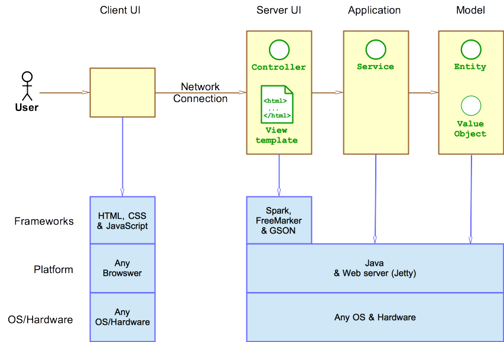

As a web application, the user interacts with the system using a browser.  The client-side
of the UI is composed of HTML pages with some minimal CSS for styling the page.  There is also
some JavaScript that has been provided to the team by the architect.

The server-side tiers include the UI Tier that is composed of UI Controllers and Views.
Controllers are built using the Spark framework and View are built using the FreeMarker framework.  The Application and Model tiers are built using plain-old Java objects (POJOs).

Details of the components within these tiers are supplied below

### Overview of User Interface

This section describes the web interface flow; this is how the user views and interacts with the WebCheckers application.

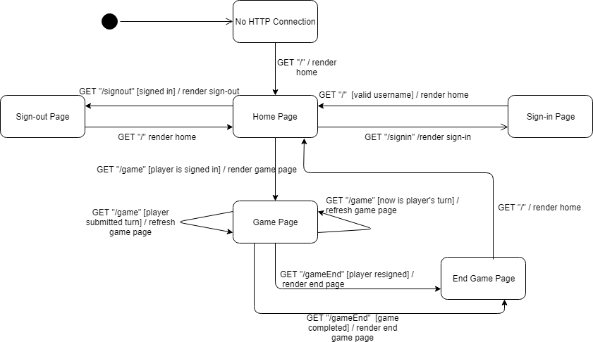

When a user first accesses WebCheckers, they are brought to the home page.
A user that is not logged in must sign-in first before they can properly play a game
or spectate.
A user that signs in is brought to the sign-in page, where they can then enter their desired username.
Once their username is validated, the user is redirected back to the home page.

A user that is signed in can begin a game with any other available users online by clicking their name on the home page.
Clicking on an available user brings both users to the game page, where the WebCheckers game is played.
The game page is updated after each move is made so that both of the users can view the state of the game.
Users are brought to the end-screen page once a game is complete or a user resigns from the game.

If the user would prefer to spectate a game instead, they can click on the name of any user currently in a game, which is
indicated by the color of their name on the home page. Once a user is spectating a game, they are brought to the game page
and can view the game through the perspective of the user they clicked on. If they wish to change the perspective of the game,
they can click on the switch views button, which will switch their view to that of the other player.
If the user wants to stop spectating a game, they can simply exit the game and return back to the home page.
If the user is still spectating a game when it is finished, they will be brought back to the home page.

### UI Tier

The UI tier of our architecture is composed of routes which aid in rendering certain aspects of the WebCheckers application
and in ensuring that the application performs as required. The tier contains 14 routes and the WebServer.

The WebServer initializes the required set of http handlers that are needed for the web application interface. The GetHomeRoute
is the first route that occurs when a user successfully accesses the WebCheckers application. The GetHomeRoute is the UI controller
that is used to GET the Home page. It's responsibility is to render the home page when needed.

The GetSigninRoute controls and renders the sign-in page. The PostSigninRoute, on the other hand, manages the sign-out page.
Once a player has successfully signed in and has found a available opponent, the two can start a game of checkers. The PostStartGameRoute
handles the action of a player clicking on another player's name when they wish to start a game. Once this action occurs, the GetGameRoute
is called. The GetGameRoute manages the game page and the display of the game board. The GetGameRoute depends on four other routes inorder
to display the correct information.

When it is a player's turn, they have the ability to make a move. Making a move evokes the PostValidateMoveRoute, which handles
determining whether or not a move the player has made is valid. If a move is not valid, the player will not be able to make such a move
and will be notified of this by a message. The PostBackupRoute handles the case in which a player has made a move that they wish to
get rid of.Once a player has made a move that they are satisfied, they can then click the Submit Turn button
to end their turn. The PostSubmitTurnRoute handles submitting the move(s) made once this button is clicked. The GetGameRoute is called after
each move is submitted, thus switching whose turn it is and updating the game board. If there is a spectator currently viewing the game, they can switch which player's 
view they are seeing, which is handled by the PostSwitchSides route.

Whenever the game page reloads, the PostCheckTurnRoute is called and handles checking whose turn it currently is.
If a player decides to resign in the middle of a game, the PostResignGameRoute handles this. If a spectator decides to
leave spectating a game, the PostEndSpectateRoute handles this. Once a game ends dues to a player winning, 
the GetGameEndRoute handles displaying the end game page that the players are redirected to. 

#### Static models
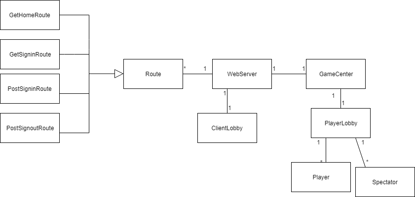

#### Dynamic models

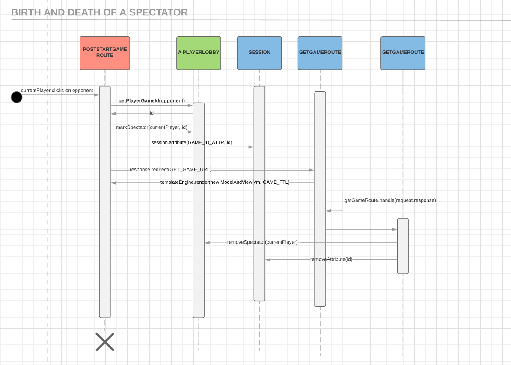

### Application Tier

The Application tier of our architecture is composed of the GameCenter, PlayerLobby and the ClientLobby. The GameCenter holds all the games that
are currently active in the WebCheckers application. The GameCenter manages games by their id. Once a game is completed, it is removed from the GameCenter.

The PlayerLobby handles all sign-ins, sign-outs, and players. The PlayerLobby handles sign-ins by making sure that a inputted username
is unique and follows the required user name rules. Once a player is signed in, they are added to the PlayerLobby and can then play games.

If a player wishes to sign out, the PlayerLobby handles this by removing their name from the list of players currently online. The removed
username is now available for anyone that signs in. 

The ClientLobby handles mapping players to their IP addresses, which is used to make the WebCheckers application asynchronous.
Overall, the PlayerCenter and GameCenter focus on management of two very important entities of WebCheckers, Players and Games.

#### Static models
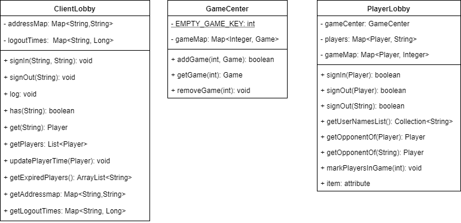

#### Dynamic models

### Model Tier

The Model tier of our architecture handles the creation of multiple important entities that are needed for the WebCheckers
application. One such component is the BoardView class. The BoardView class handles the representation of a checkerboard by using an 8 by 8 matrix.
The matrix created by BoardView relies on Row and Space, which are two other components of the Model tier.

The Row class handles representing each row of a checkerboard. A single Row is composed of eight Spaces, which represent locations
or squares on a checkerboard. A Space is either black or white and can hold a Piece.

The Piece class creates and represents a piece on a checkerboard. Pieces can be either kings or singles and can be red or white.
A Piece can only become a king by reaching the last row of their opponent's side of the board. Piece handles this case by changing
a single piece to a king piece when needed.

The position of a Piece is handled by the Position component. Position represents the location of a Piece on the BoardView. A Position
is created based upon a given row and space of the board. Another important component of the Model tier is the Player class.
Player creates and manages a player based upon a valid username.

The Player, BoardView, and Piece classes are all used in the Game component. Game creates a single game, which contains two opponents,
the game board and other information needed for a game of WebCheckers. The two opponents in a game are the red player and the white player.
These two players are created with Player. The BoardView is used to create the game board on which Pieces can move. There is another
component of this tier, the Message component, which handles generating various types of messages for a game. Overall, the various components of
the Model tier interact with each other in order to create a single game of WebCheckers.

#### Static models
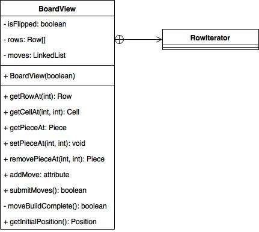
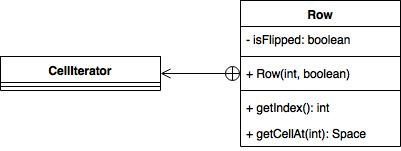
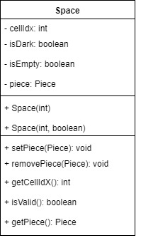
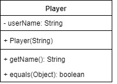
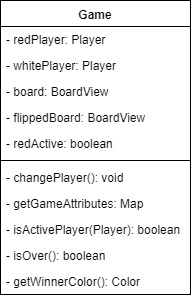

#### Dynamic models

### Code Coverage

In this section we will address the current code coverage of the WebCheckers application based upon it's tiers.

#### UI tier
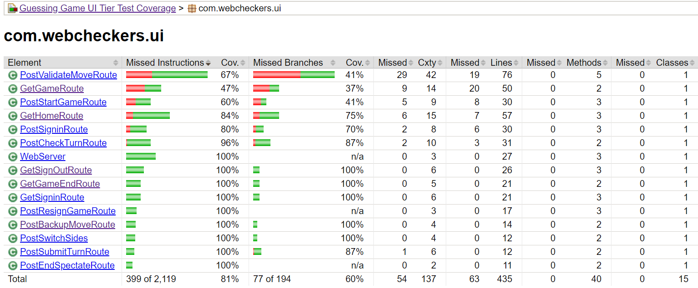

As can be seen from UI code coverage image, 9 of the UI routes have 100% coverage while the rest of the routes have below
85% coverage. The PostValidMoveRoute, PostStartGameRoute, and the GetGameRoute have poor coverage, ranging from 67% to
47%. GetGameRoute has the worst coverage, which is 47%. Further testing of these routes are needed to ensure they meet a 
better level of coverage.

#### Application tier

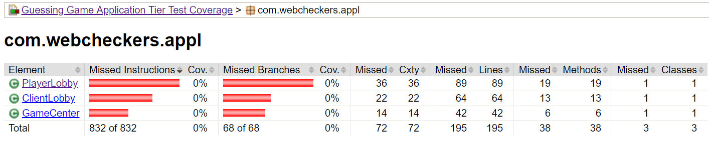
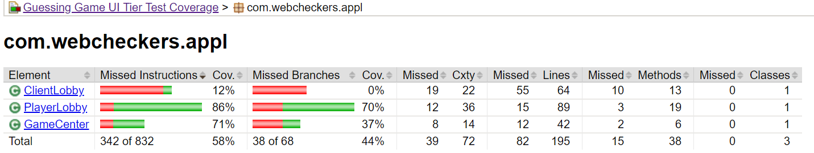

The results of the Application tier code coverage are somewhat strange. The coverage of all classes in the Application tier are 0%,
despite the fact that they all have unit tests. These classes only seem to have coverage when looking at the Application tier from
the generated UI tier coverage report. However, when "Run with Coverage" in IntelliJ the statistics for each is quite high (line coverage of over 90%) and they look comprehensive to us, so we cannot explain the jacoco results. 

#### Model tier

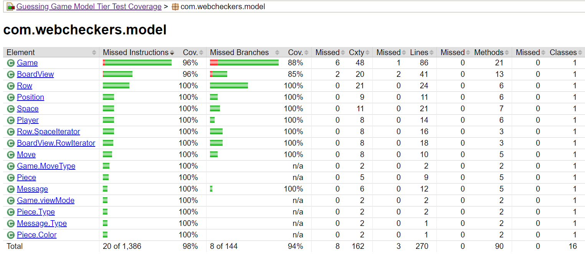

The coverage of the Model tier is excellent. All of the Model classes have above 95% coverage, 
with all but two achieving 100% coverage. The Game and Boardview classes have 96% coverage and therefore
some more tests could be created if desired, however, their coverage is still quite good. 

Overall, Most of the classes in each tier, aside from the Application tier, have a good amount of coverage. The Model tier
has the best coverage of the 3 tiers and more testing should be done for the UI and Application tiers. 

### Code Metrics
In this section we will discuss the WebChecker application's performance
based upon various code metrics. 

#### Chidamber-Kemerer metrics
The Chidamber-Kemerer metrics is composed of 6 metrics. The goal of these metrics is to capture different aspects of
object-oriented design. The 6 metrics are:
1. CBO (Coupling between objects)
2. DIT (Depth of Inheritance Tree)
3. LCOM (Lack of cohesion of methods)
4. NOC (Number of children)
5. RFC (Response for class)
6. WMC (Weighted method complexity)

The results of the Chidamber-Kremerer metrics for the Webcheckers application showed that all levels of the application
(packages, classes, and methods) met the desired target ranges for each of these metrics and that there were no notable outliers.

#### Complexity metrics

The results of the Complexity metrics indicated that a couple classes were out of the desired target range. These classes
are the PlayerLobby, Game, GetGameRoute, GetHomeRoute, PostCheckTurnRoute, PostSigninRoute, and the PostValidateMoveRoute
classes. These classes had either above average operation complexity or above average weighted method complexity. 

Upon closer inspection of the Method metrics, it can be seen that the above average results for some of these classes was due
to certain methods. The PlayerLobby's signIn method had an above average essential cyclomatic complexity, ev(G), which indicates
that the method has a poor amount of structuredness.
Another method that had a higher than average ev(G) was the Boardview's hasNext() method. Although this method has an above average
measure, it did not impact the overall complexity of the BoardView class.
One very noticeable observation when inspecting the results of the Method metrics was that multiple methods of the PostValidateMoveRoute
had above average results for various measurements. The most noticeable result was that of the moveIsValid() method, which has a quite
above average result of 17 for the Cyclomatic complexity.

Overall, the fact that there were quite a lot of classes and packages that were not within the desired ranges of complexity indicates that
that certain methods and classes are too complex, and could therefore impact any future modification.

#### Javadoc coverage metrics
It is hard to hold Javadoc coverage to an empirical standard or ask that it reach a defined threshold. Doing so could lead to pointless, vague documentation "noise."

Regardless, looking at our coverage metrics is becomes clear that coverage in our test classes leaves something to be desired.

#### Lines of code metrics
Lines of code: there is a pattern: almost twice as many lines of code in the model tier as the application tier. Sensible. And then almost twice as many lines of code in the UI tier than the model tier. Insane? The UI tier should have probably been more in line with the model tier. Our end product had classes with many responsibilities rather than high cohesion, leading to bloat in the UI tier.

#### Martin package metrics
Afferent coupling (Ca) measures incoming dependencies of classes, thusly their susceptibility to change. Our average Ca of 12.3 falls well within the desirable range of 0–500. Efferent coupling (Ce) measures how interrelated classes are, how vulnerable they are to changes within the packages on which they depend. Ce values should be within 0–20: most of our packages fall within that range but the UI package blows it well out of the water at 108. This could be lowered by breaking down classes into smaller classes. Not prioritizing loose coupling would probably be the party at fault here, doing things like deconstructing PostValidateMove into pieces, including a pure fabrication class that does the move analysis.

Instability measures how susceptible classes are to change, with either strong stability (0.0–0.3) or strong instability (0.7–1.0) desired. Abstraction measures the ratio of abstract to concrete classes in a package. Our average abstractness (A) is 0.02 compared to an average instability (I) of 0.75: when instability is high, low abstractness is desirable (optimally, I + A = 1, which we did not quite achieve).

Normalized distance from the main sequence (D) measures the balance between abstractness and instability. Our abstractness and instability do not quite sum to 1 which leaves a distance of .23, which is still a low value, though not the desirable 0.1.

### Final Design and Improvements

#### Final Design
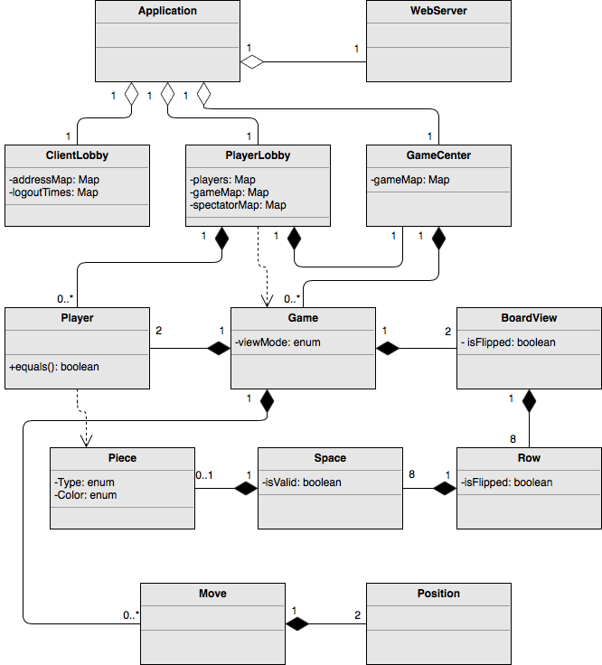
Ours is a three-tiered design, separating application, model, and user interface. Above is a class diagram of the application and model tiers.

The application tier is composed of three classes which are essentially maps plus methods. ClientLobby keeps track of everyone who is viewing the website and enables asynchronous play, PlayerLobby keeps track of the players, the spectators, and the games they are playing/watching. GameCenter keeps track of games.

The model tier is made up of elements from the problem domain. The closest class to a pure fabrication is the Game class, and that is arguable. If you think of Message as the communication that happens between players, then everything in the model package represents a real-life entity.

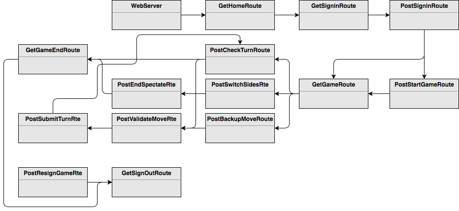
The UI tier encompasses all of the interactions the user can have with the game and the WebServer. The user signs in; selects a player to challenge or to watch play; plots out moves and retracts them; finishes a game, resigns a game, or just decides to stop watching a game; and finally logs out. All this is achieved through routes.

#### Possible Improvements
Our design should be broken down into more, smaller classes to make it easier to modify. The complexity metrics and Martin package efferent coupling metrics both suggest there is a lot of work to be done in the UI tier. One good place to start would be to create a Rules class in the model tier which handles move validation, taking the weight off of PostValidateMove and its moveIsValid() method. Another issue is abstractness versus stability. Since we are looking for instability and abstractness to sum to one, we could create more abstract classes, such as a client class from which player a spectator class could inherit. Another approach would be to increase the overall instability of the design. Bearing in mind that the UI tier is already far too unstable, we could reduce the stability of the model tier by reducing fan-in.

